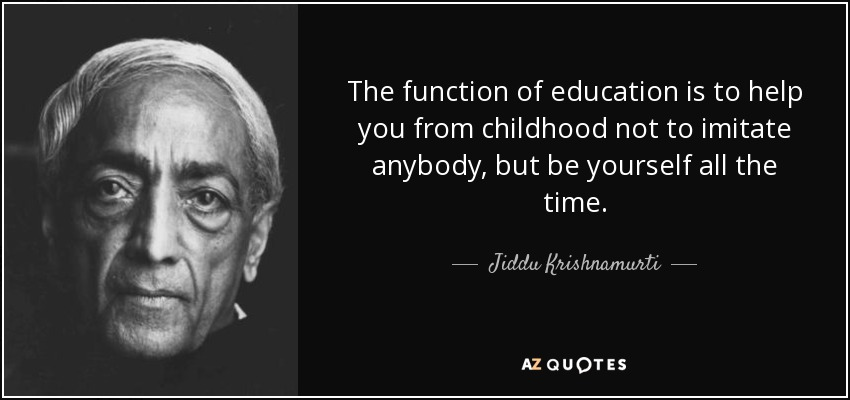
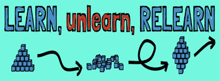
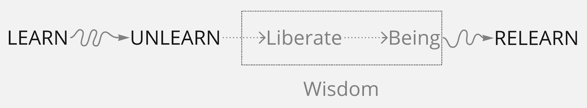
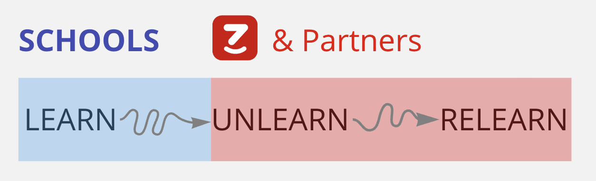

“Điều gì dẫn dắt chúng ta đến mỗi quyết định của mình?” - câu hỏi này đã bỗng dưng hiện lên trong đầu tôi khi đang học năm 2 Đại học, vào thời điểm mà tôi đang cảm thấy bản thân bị kìm hãm bởi hệ quả của chính những quyết định của mình.

Lúc đó, tôi chán trường lớp đến mức muốn bỏ học. Tôi cảm thấy ngôi trường đó, với những môn học nhàm chán và cũ kỹ, đang mỗi ngày bào mòn đi nhựa sống của một người trẻ tràn đầy năng lượng. Nhưng chọn bỏ học cũng là chọn bỏ một ngôi trường danh tiếng gắn liền với bao nổ lực của tôi để đến được đó cùng với bao kỳ vọng của gia đình mong vươn lên trong sự thiếu thốn cơ hội học tập ở vùng quê tôi. Điều đó cũng có nghĩa là vứt bỏ đi vô vàn những danh hiệu lấp lánh khác nhau mà tôi đã ra sức phấn đấu để gắn lên mình.

Tôi sợ. Và không biết rõ mình sợ điều gì. Nhìn lại bản thân, tôi cũng không biết tại sao tôi chọn thi và học ở ngôi trường này, ngoài câu chuyện “danh tiếng và của cải” mà mọi người xung quanh đều nhắc đến và cho là tối quan trọng. Tôi bắt đầu đặt một dấu chấm hỏi đầy hoài nghi về giá trị của nền giáo dục mà tôi và các bạn đang thụ hưởng.

Tôi đi tìm cho mình câu trả lời bằng cách dấn thân vào tất cả những gì tôi có thể làm ngoài trường học. Tôi đã đi đến nhiều nơi và làm nhiều công việc khác nhau. Sau này tôi mới nhận ra: tôi đang phản ứng với “cái không biết” (“the unknown”) bằng cách tái thiết chính sự học của mình (“unlearn”) và học lại chúng (“relearn”). Unlearn cũng đồng nghĩa với việc quên đi toàn bộ những gì mình đã được học và cách mình đã học chúng, và hình thành những góc nhìn mới; trong khi relearn là việc tối ưu hoá lại nội dung và cách học với những góc nhìn mới đó. Để làm được điều này, tôi (thú vị thay) đã chọn trở thành một nhà đào tạo. Công việc của tôi bao gồm cả thiết kế chương trình và trực tiếp giảng dạy. Trên hành trình tìm hiểu và hoàn thiện bản thân trong công việc này, tôi đã liên tục “unlearn & relearn” tại những cột mốc mang tính chuyển đổi lớn trong cuộc sống:

> “Unlearn & relearn” lần 1: 12 năm trước, lần đầu tiên tôi đi ra nước ngoài. Tôi
> tham dự một chương trình đào tạo của World Bank ở Coimbatore, Ấn Độ. Ấn Độ thật
> lạ với những chiếc xe buýt không cửa, xe gắn máy như bộ khung sắt di động ở khắp
> mọi ngóc ngách trên đường phố và ở đó không có áo mưa! Ngày đầu trong chương trình,
> tôi tiếp xúc với 37 con người đến từ 20 quốc gia khác nhau trong một tâm trạng
> đầy hoang mang. Tôi không nói được tiếng Anh và cũng không hiểu mấy nội dung hằng
> ngày được nghe. Tôi cảm thấy bất lực và vô dụng khi bị choáng ngợp với quá nhiều
> thứ mới mẻ. Vào những ngày cuối của chương trình, tôi lấy hết sự quyết tâm mình
> có để tự thiết kế ra cách học mới (do là tôi học không hiểu gì) và chia sẻ với
> cả lớp vào ngày khóa học kết thúc. Vỡ oà trong hạnh phúc và ngạc nhiên, tôi vinh
> dự được nhận giải thưởng nhà đào tạo sáng tạo và được chương trình trao chứng nhận
> (mà đáng ra tôi đã không đủ tiêu chuẩn).
>
> “Unlearn & relearn” lần 2: Chuyến đi đầu tiên đó đã chắp cánh cho nhiều chuyến
> đi khác của tôi ở khắp Châu Á và Mỹ trong chỉ hai năm sau đó. Tôi khát khao được
> biết nhiều hơn, làm nhiều hơn, đạt được nhiều thành tựu hơn và lại một lần nữa
> gắn lên mình nhiều danh hiệu lấp lánh hơn. Tôi đã khởi nghiệp với sự ủng hộ mạnh
> mẽ của truyền thông và chấp nhận thất bại sau đó một năm. Tôi cố chấp vào cái mình
> có để thấy bản thân sống có ý nghĩa và hạnh phúc. Nó dẫn tôi đến quyết định chọn
> một môi trường khác để unlearn lần nữa, bằng cách đi đến những vùng xa xôi vì những
> chương trình đào tạo xã hội phi lợi nhuận. Trong thời gian này, tôi được biết đến
> và chịu ảnh hưởng lớn bởi tư tưởng giáo dục của Jiddu Krishnamurti và triết lý
> sống của Lão Tử. Tôi đã sống ở mức nhu cầu tối thiểu nhất để chối bỏ mọi danh hiệu
> có thể gắn lên mình.
>
> “Unlearn & relearn” lần 3: Cũng vào năm đó, gia đình tôi gặp biến cố lớn và căn
> hộ tôi đang sống lại không may xảy ra hoả hoạn làm mất mát nhiều sinh mạng và của
> cải. Tôi may mắn thoát nạn. Một thời gian dài sau đó, việc tôi có thể bình an sống
> theo chủ nghĩa tối giản (“minimalism”) với vài bộ áo quần đơn sơ và những bữa ăn
> rau đậu làm tôi thấy mình như đã thông suốt và sẵn sàng cho mọi thử thách. Nhưng
> một lần nữa, tôi lại nhận ra mình đang thần thánh hóa phương tiện của mình với
> niềm tin rằng chỉ có sống tối giản mới đem lại một cuộc sống hiệu quả. Tôi chuyển
> từ trạng thái chấp có (phải sở hữu) sang chấp không (phải không sở hữu) và tự phân
> cực mình từ cực này sang cực khác. Nhận ra những thiếu sót trong tư duy này khiến
> tôi lại tiếp tục unlearn để tìm sự cân bằng. Tôi quay lại với những cuộc phiêu
> lưu đầy cám dỗ của việc khởi nghiệp, nhưng với một tâm thế đã khác.
>
> “Unlearn & relearn” lần 4: Tôi hiểu rõ hơn mục đích và sự lựa chọn phương tiện
> của mình. Tôi thành lập iZi với một tâm thế tự do và mong muốn làm cho tri thức
> và các cơ hội trở nên dễ tiếp cận hơn cho tất cả mọi người. iZi, trong hình dung
> của tôi, sẽ giúp mọi người mở rộng thế giới quan và từ đó đạt được sự tự do cho
> riêng mình. Trên hành trình này, đôi lúc tôi trôi lạc theo phản ứng của số đông.
> Tôi theo đuổi những con số. Và chới với với việc định hình giá trị mà tôi và đồng
> đội muốn tạo ra. Tôi quyết định unlearn bằng một chuyến đi không kỳ vọng đến vùng
> núi Himalaya ở Ladakh. Những ngày trên núi tuyết không có internet, mạng viễn thông
> và những tiện nghi cơ bản, tôi mất kết nối với thế giới bên ngoài nhưng một cách
> không mong đợi lại tạo ra kết nối mạnh mẽ với thế giới bên trong. Những lần unlearn
> trước là ở những sự kiện mang tính chuyển đổi lớn về tâm lý, còn lần này là nhờ
> vào những niềm vui vô điều kiện (“joy”). Nó giúp tôi bớt sống ở tương lai và trân
> trọng hoàn toàn sự hiện diện của mọi thứ ở hiện tại.

Trong suốt quá trình unlearn & relearn liên tục này, tôi nhận ra một chân lý. Nếu như chúng ta đồng tình rằng chân lý là một sự thật không thể phản đối và không cần phải chứng minh, thì thứ chân lý tôi tìm được trong ý nghĩa của giáo dục là “sự tự do” (“liberation”). Có nhiều cách để hiểu “sự tự do”, nhưng với tôi, khái niệm đó được dùng để mô tả việc chúng ta hiểu sâu sắc bản thân mình, biết trân trọng sự hiện diện của mình, và biết rõ những ảnh hưởng trong một quyết định lựa chọn phương tiện để mình biểu đạt vào cuộc sống.

**Niềm vui và sự tự do là giá trị mà chúng tôi, thông qua iZi, muốn tạo ra cho cộng đồng.**

Nền giáo dục mà chúng tôi được thụ hưởng hơn 16 năm không dạy cho chúng tôi những điều đó. Chúng tôi được dạy cách sử dụng phương tiện để có đời sống hiệu quả và cũng đồng thời làm đồng hoá mình với những phương tiện đó. Chúng tôi trở thành nô lệ cho các phương tiện thay vì làm chủ chúng. Bàn về việc này không có nghĩa là chúng tôi chối bỏ trường học. Ngược lại, trường học đối với chúng tôi là một phát kiến vĩ đại của văn minh nhân loại để con người tiếp cận với tri thức dễ dàng hơn. Chúng ta đã làm rất tốt việc đó trong thời kỳ thiếu hụt phương tiện truyền tải thông tin.

Nhưng với bối cảnh ngày nay, internet, viễn thông, điện thoại vệ tinh và giao thông phủ dày đặc địa cầu đã giúp cho việc tiếp nhận thông tin và hình thành thế giới quan trở nên tự do, khách quan và cá nhân hoá hơn bao giờ hết. Trong khi đó, sách giáo khoa và giáo viên dù xuất sắc đến mấy cũng vẫn sẽ dính mắc vào tư duy chủ quan. Vì vậy, cần thiết để bổ sung cho việc tiếp thu tri thức (“learn”) hai công việc vô cùng quan trọng: tái thiết tri thức (“unlearn”) và tối ưu hoá lại việc tiếp thu tri thức (“relearn”). Trong đó, tái thiết là quá trình nền tảng để dẫn tới sự tự do. Và việc này không phải chỉ diễn ra ở một thời điểm hay trong một giai đoạn mà là sẽ xuyên suốt cả hành trình cuộc sống.

“Unlearn” và “relearn” không phải là một phát kiến mới mà là cách dùng từ mới. Nó là một sự đúc kết của văn minh nhân loại bắt nguồn từ cách đây gần 3000 năm ở thời La Mã và Hy Lạp cổ đại. Khi đó chúng ta đã nói đến một nền giáo dục hướng về con người tự do - “giáo dục khai phóng” (“liberal education”). Vào thế kỷ XIX, sự phát triển ồ ạt của phong trào công nghiệp hoá - hiện đại hoá đã đẩy “giáo dục khai phóng” dần chìm vào quên lãng và đưa “giáo dục chuyên nghiệp” lên vị thế thống trị tại hầu hết các nền văn hoá. Đó là thời điểm mà nền giáo dục như chúng ta biết đến ngày nay ra đời và được duy trì suốt hơn hai thế kỷ qua. “Giáo dục chuyên nghiệp” ra đời vì yêu cầu tốc độ trong việc phổ cập công nghiệp hoá - hiện đại hoá. Và vì thế, xu hướng đó dẫn chúng ta đi gần hơn với các phương tiện công nghiệp hiện đại và đi xa hơn với mục đích của hiện sinh (“Being”) mà nền tảng của nó là sự tự do. Vậy, chúng ta học cách “unlearn” tức là học cách tư duy để hiểu mình hơn và tách khỏi những tri thức và mô tuýp cũ để có cái nhìn toàn vẹn hơn, và từ đó hình thành nên trí tuệ.

“Unlearn” và “relearn” không thể tách rời và luôn luôn đi cùng nhau. Có hai thời điểm tốt nhất để quá trình này diễn ra: tại các sự kiện cá nhân có tính chuyển đổi lớn về tâm lý, và khi tận hưởng niềm vui vô điều kiện (“Joy”). Thời điểm thứ nhất không thường xuyên xảy ra nhưng thời điểm thứ hai thì có thể. Vì lẽ đó, triết lý giáo dục mà chúng tôi dùng làm xương sống cho iZi là mang lại niềm vui cho người học để thúc đẩy quá trình “unlearn” diễn ra, qua đó người học hiểu về bản thân họ và đạt tự do. Chỉ khi có sự tự do thì “relearn” mới bắt đầu hiệu quả và đó là lúc mà iZi mang tới cho người học những cơ hội thực tiễn về việc sử dụng phương tiện cho sinh kế và đạt mục đích hiện sinh của họ. iZi ra đời với mong muốn song hành với trường học và hệ sinh thái các đối tác liên quan để tiếp tục kiện toàn và phát triển ý nghĩa giáo dục mà tôi đã chiêm nghiệm và hằng mong lan tỏa đến cộng đồng trên toàn thế giới.

