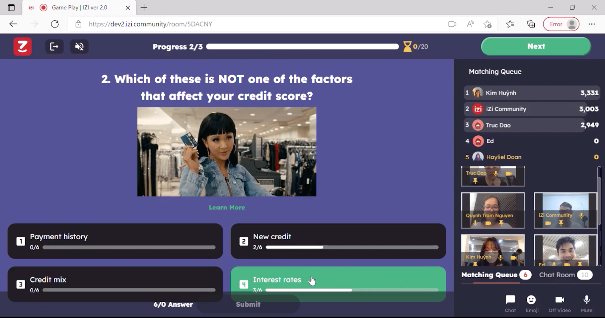
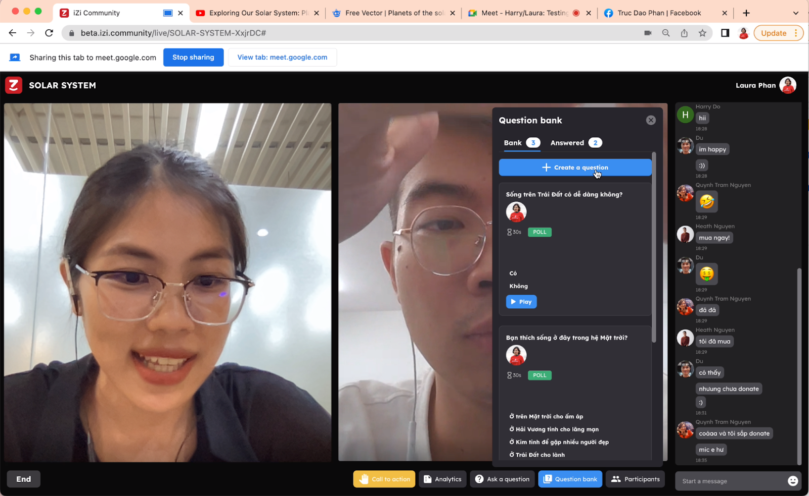

import { EmbeddedYoutube } from "@site/src/components/embedded-youtube";

import { ImageDescription } from "@site/src/components/image-description";

import { ProfileHref } from "@site/src/components/profile-href";

iZi là nền tảng công nghệ trò chơi hoá kiến thức, ra đời với sứ mệnh **“làm cho tri thức và các cơ hội trở nên dễ tiếp cận hơn với tất cả mọi người”**. iZi tạo niềm vui bằng thiết kế trò chơi và cơ chế phần thưởng, đồng thời mang lại giá trị giáo dục thông qua nội dung kiến thức phong phú dưới dạng câu hỏi tương tác.

Các cá nhân, đặc biệt là nhóm học sinh - sinh viên, có thể vừa khám phá tri thức vừa tìm kiếm các cơ hội thông qua các giải thưởng sau mỗi Quest. Riêng với các tổ chức và doanh nghiệp, iZi cung cấp giải pháp toàn diện từ tuỳ chỉnh thiết kế trò chơi đến sáng tạo nội dung để giúp hoạt động đào tạo nội bộ và kết nối cộng đồng có tương tác cao và ý nghĩa hơn.

iZi ra mắt phiên bản đầu tiên vào tháng 2 năm 2021 với sự đón nhận nhiệt tình từ cộng đồng sáng tạo nội dung, cộng đồng giáo viên và các sự kiện lớn nhỏ trong cộng đồng sinh viên của hơn 50 trường Đại học tại Việt Nam. Là một nền tảng gamification đơn giản, thân thiện để tạo và chơi quiz, iZi đã có hơn 3.000 bộ nội dung do người dùng tạo và 100.000 người dùng hữu cơ thông qua Word-of-Mouth (truyền miệng) chỉ trong năm đầu tiên ra mắt.

Niềm vui và sự phấn khởi của cộng đồng khi sử dụng iZi làm chúng tôi có niềm tin mạnh mẽ vào việc ứng dụng gamification để truyền tải kiến thức sẽ tạo ra một sự thay đổi bước ngoặt với cách chúng ta đang dạy và học.

<EmbeddedYoutube url="https://www.youtube.com/embed/iMIxR40HNwg" />

Với mong muốn thúc đẩy tính đổi mới sáng tạo cho sản phẩm, đội ngũ iZi đã liên tục thực hiện 4 phiên bản thử nghiệm (2.0, 3.0, 4.0 và 5.0) trong 9 tháng tiếp theo sau đó. Trung bình khoảng 2 tháng, chúng tôi phát hành một phiên bản mới để nâng cấp trải nghiệm chơi như bùa tăng sức mạnh, trò chuyện qua text, audio và video, broadcasting, tranh luận,... Các phiên bản được trải nghiệm bởi nhóm cộng đồng người dùng trung thành và thân thiết của iZi để ghi nhận phản hồi về cả sản phẩm và mô hình kinh doanh.

<ImageDescription
  texts={[
    "Phiên bản 2.0",
    "Trò chuyện trực tiếp qua audio/video trong phòng chơi quiz",
  ]}
/>

<ImageDescription
  texts={[
    "Phiên bản 3.0",
    "Broadcast trực tiếp với bộ quiz tạo tại chỗ, có thể multi-stream tới nhiều cộng đồng",
  ]}
/>

<ImageDescription
  texts={[
    "Phiên bản 4.0",
    "Các video trong format tranh luận được ghi trước, kèm với câu hỏi có thể tương tác tại lúc xem",
  ]}
/>

Qua những lần thử nghiệm và những cuộc trao đổi sâu sắc với người dùng, chúng tôi hiểu rằng:

- Đa số người học phổ thông quan tâm tới trải nghiệm học hơn hẳn nội dung học. Trải nghiệm đó đòi hỏi nhiều **niềm vui, cảm hứng, đam mê và tính cộng đồng**. Do đó gameplay được iZi chú trọng xây dựng với các luật chơi cộng đồng cùng nhiều giải thưởng có ý nghĩa ([xem thêm lộ trình phát triển sản phẩm tại đây](/blog/04-the-journey-to-find)).
- Song song đó, nội dung giáo dục cần đa dạng, có chất lượng nhất quán và liên quan tới nhu cầu học tập và tìm hiểu kiến thức của người dùng. Qua đó, iZi đẩy mạnh hợp tác với các đối tác nội dung là trường, viện, tổ chức; đồng thời cho phép cộng đồng tự đóng góp nội dung với hệ thống kiểm duyệt. Nội dung iZi đang tập trung xây dựng xoay xung quanh chủ đề “nghề nghiệp và tài chính”, cùng với các chủ đề vệ tinh khác ([xem thêm chiến lược nội dung tại đây](/blog/03-content-strategy-and-governance)). Khai thác tính đa dạng hoá của nội dung, iZi cũng lên lộ trình để đáp ứng tính cá nhân hoá của người dùng.
- Ngoài ra, cộng đồng người dùng cũng mong muốn được trao quyền kinh tế trong các hoạt động xã hội tại nền tảng, từ việc tạo và tiêu thụ nội dung đến việc thiết kế và trao đổi vật phẩm. iZi hướng tới việc xây dựng cơ chế kinh tế công bằng cho thành viên tạo ra giá trị giáo dục thông qua nội dung và thành viên tạo ra giá trị giải trí bằng các thiết kế và sự tham gia hoạt động.

<EmbeddedYoutube url="https://www.youtube.com/embed/rfXja72xaik" />

Đằng sau sự kiên trì cho những hoạt động cải tiến liên tục này là một đội ngũ đầy nhiệt huyết và đam mê với giáo dục, các câu chuyện kể và các trò chơi lớn nhỏ. Đội ngũ iZi không những mang tinh thần tự do của những nhà cải tiến mà còn là những chiến binh bản lĩnh và trách nhiệm trong vai trò và công tác chuyên môn của mình.

<ProfileHref
  title={"Team Linkedin Contact:"}
  profiles={[
    { name: "Laura", href: "https://www.linkedin.com/in/lauradaophan/" },
    { name: "Heath", href: "https://www.linkedin.com/in/hieu-nguyen/" },
    { name: "Nam", href: "https://www.linkedin.com/in/nam-q-dam/" },
    { name: "Khoa", href: "https://www.linkedin.com/in/khoa-hoang/" },
    { name: "Son", href: "https://www.linkedin.com/in/sonhoaing/" },
    { name: "Cynthia", href: "https://www.linkedin.com/in/tram-cynthia/" },
    {
      name: "Hồng",
      href: "https://www.linkedin.com/in/h%E1%BB%93ng-%C4%91%E1%BB%97-thu-a4b53b1b7/",
    },
    { name: "Du", href: "https://www.linkedin.com/in/ed-pham-83722921a/" },
    { name: "Khang", href: "https://www.linkedin.com/in/khang-nguyen-hoang/" },
  ]}
/>

Tiếp thêm một nguồn sức mạnh lớn lao cho hành trình này là những con người đã tin tưởng đầu tư vào chúng tôi và liên tục hỗ trợ mọi lúc khi chúng tôi cần bất kể thử thách. Họ là những doanh nhân và nhà đầu tư đến từ nhiều nơi trên thế giới với những đóng góp rất đáng tự hào cho xã hội. Chính họ cũng là nguồn cảm hứng to lớn giúp chúng tôi thêm sự kiên trì với sứ mệnh của mình.

<ProfileHref
  title={"Linkedin Contact:"}
  profiles={[
    {
      name: "Kyounghwan Kim",
      href: "https://www.linkedin.com/in/kyounghwan-kim-440934a/",
    },
    { name: "Bryan Pelz", href: "https://www.linkedin.com/in/bryanpelz/" },
    { name: "Buzz Palmer", href: "https://www.linkedin.com/in/buzzpalmer/" },
    {
      name: "Ray Lee",
      href: "https://www.linkedin.com/in/jongheun-lee-7a4399111/",
    },
  ]}
/>

Chúng tôi liên tục tìm kiếm các tài năng mang tinh thần tự do và vui vẻ để cùng theo đuổi sứ mệnh “làm cho tri thức và các cơ hội trở nên dễ tiếp cận hơn với tất cả mọi người” thông qua gamification. Nếu bạn là nhân vật ấy và khao khát đồng hành cùng chúng tôi thì hãy gửi một quả intro cool ngầu của bạn đến [hr@izi.community](mailto:hr@izi.community) nhé!
