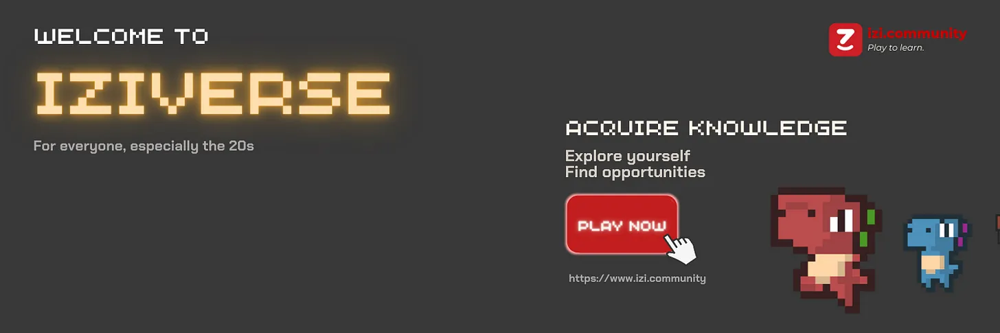

Hành trình tìm kiếm tri thức là một cuộc phiêu lưu kỳ thú và ẩn chứa nhiều bất ngờ. Trên con đường ấy, chúng ta có thể khám phá ra rất nhiều điều mới mẻ và liên tục khai phá những vùng trời tri thức mới. Trong vòng chưa đầy 2 năm kể từ ngày thành lập, iZi tự hào đã đóng vai trò là người mở đường cho hơn 2K nhà sáng tạo bước ra khỏi vùng an toàn và tạo ra những nội dung giáo dục mang tính thay đổi cuộc chơi. Niềm vui của iZi là thức dậy hàng ngày và biết được rằng cộng đồng với hơn 100K người học của chúng ta luôn học được những điều mới mẻ trên iZi. Chúng tôi tự hào khi thấy mọi phiên bản trước đây của iZi được chào đón nồng nhiệt từ nhiều cộng đồng, ngay cả từ những ngày đầu khi iZi vẫn còn là một trang web đố vui với giao diện và tính năng đơn giản. Tuy nhiên, tất cả mới chỉ là sự khởi đầu.

Bắt đầu từ hôm nay, iZi sẽ đưa bạn đến một chương mới trong hành trình của chúng tôi. Đó là một cuộc hành trình đến một vũ trụ song song - Vũ trụ Chơi-mà-Học (play-to-learn) có tên iZiverse - nơi bạn sẽ có nhiều tự do hơn bao giờ hết để khám phá, thu thập và áp dụng kiến ​​thức trong bất kỳ khía cạnh nào của cuộc sống dưới dạng một trò chơi nhập vai giải đố săn thưởng trong môi trường 8-bit. Ở đó, bạn sẽ phiêu lưu trí não qua các nội dung Hỏi & Đáp đa định dạng và nhận bất ngờ từ một cơ chế phần thưởng hoàn toàn mới đến từ iZi. iZiverse muốn mang đến cho cộng đồng iZi một cơ hội hiếm có để phát triển và trở thành một cộng đồng thực sự tự do, nơi người dùng có thể nắm giữ quyền lực cao nhất trong việc cho, nhận và tạo ra giá trị. Chúng tôi đã làm việc chăm chỉ để hiện thực hóa tầm nhìn trên trong nhiều tháng nay và iZi hân hạnh để có thể được chia sẻ những tầm nhìn và dự định sắp tới với bạn!

<h2>Tầm nhìn của iZi</h2>

Tầm nhìn dài hạn của iZi nằm ở khả năng xây dựng một cộng đồng tự do bằng việc cung cấp kiến ​​thức đa dạng thông qua niềm vui và trao quyền cơ hội. Tại iZi, chúng tôi đề cao một triết lý trong giáo dục, đó là việc thu nhận kiến ​​thức sẽ đạt được kết quả tốt nhất là dưới hình thức “unlearning and relearning”. Cách thức này sẽ phát huy hiệu quả tối đa khi được đặt trong điều kiện tâm lý bị thử thách để đạt được kết quả mong muốn và những khoảnh khắc của niềm vui vô điều kiện. Chúng tôi tin rằng: khi việc tiếp thu kiến ​​thức diễn ra trong hoàn cảnh hỗn loạn có kiểm soát đan xen với những tình huống phức tạp đa chiều và những niềm vui đầy bất ngờ và vô tư, chúng ta học tốt nhất!

Phải chăng đã đến lúc trải nghiệm tiếp thu và chia sẻ kiến ​​thức một cách chủ động và thú vị được tiếp cận bởi một cộng đồng đông đảo hơn. Phải chăng đã đến lúc những người sáng tạo nội dung được giải phóng họ khỏi những ràng buộc về sáng tạo và giúp họ tạo ra nội dung giáo dục thực sự có ảnh hưởng. Và phải chăng đã đến lúc chúng ta cùng học hỏi, cởi mở và làm mới kiến thức trong một cộng đồng tự do. iZi biết câu trả lời. iZi LÀ câu trả lời.

Sự tự do là linh hồn trong hệ sinh thái sản phẩm và cộng đồng của iZi. Chúng tôi luôn cố gắng tạo ra một sân chơi nơi cả nhà sáng tạo và thành viên cộng đồng có thể tự do tương tác dựa trên một chuỗi các quy tắc cơ bản. Chúng tôi khuyến khích những nhà sáng tạo nội dung tự do mang đến những nhiệm vụ độc đáo mang tính giáo dục cho người học dựa trên nguyên tắc cộng đồng của iZi. Chúng tôi đánh giá cao quyền tự do lựa chọn của các thành viên trong cộng đồng và sẵn sàng khuyến khích họ có tiếng nói về những mong muốn tìm hiểu và quyết định hỗ trợ bất kì người sáng tạo nào. Tóm lại, iZi khuyến khích “sự hỗn loạn có kiểm soát” trong việc chia sẻ và học hỏi kiến ​​thức.

Một nền tảng phù hợp đóng vai trò tối quan trọng trong việc nuôi dưỡng sự sáng tạo và trí tò mò. iZiverse mang sứ mệnh đặt nền móng vững chắc cho hành trình phát triển cá nhân của vô số thế hệ nhà sáng tạo và người học. 7 Vùng đất của iZiverse hợp lại tạo nên một thế giới rộng lớn ẩn chứa nhiều thách thức cũng như cơ hội để các nhà thám hiểm iZi vượt qua chính mình vì chúng tôi có niềm tin mạnh mẽ rằng chỉ khi trải qua sự hỗn loạn, con người mới có thể tiến về phía trước trong hành trình khám phá bản thân. Ẩn chứa và rải rác trong mỗi Vùng đất là những kiến ​​thức được truyền đạt dưới dạng Nhiệm vụ (các trò chơi Hỏi & Đáp đa phương tiện và đa định dạng) với nội dung được chọn lọc một cách kỹ lưỡng, các nhân vật vô cùng đáng yêu theo từng tuyến truyện và phần thưởng hấp dẫn được trao dưới dạng quà tặng đặc biệt hoặc những cơ hội có ý nghĩa.

<h2>Lộ trình phát triển sản phẩm - Q4/2022</h2>

Quý 4 năm 2022 sẽ đánh dấu một cột mốc quan trọng của iZi khi chúng tôi đặt mục tiêu khép lại năm 2022 một cách rực rỡ. Các tính năng đã được cộng đồng yêu cầu và vô cùng mong chờ sẽ sớm được phát hành kèm theo các bản cập nhật sản phẩm quan trọng, tạo nền móng cho việc mở rộng và tích hợp trong tương lai.

<h2>
  iZi 5.0 - Phát hành iZi trên nền tảng iOS & Android; Giám sát và cải tiến độ
  ổn định của sản phẩm
</h2>

Với phiên bản 5.0, giờ đây bạn đã có thể truy cập iZi mọi lúc, mọi nơi! Tương tác với iZi chưa bao giờ dễ dàng hơn thế. Chúng tôi rất vui mừng thông báo rằng iZi sẽ có mặt trên các thiết bị di động của bạn! Đây là một trong những sự tích hợp được yêu cầu nhiều nhất từ cộng đồng iZi. Đây cũng là một sự tri ân tới những trải nghiệm chơi game 8-bit cổ điển ngay trong lòng bàn tay của bạn. Thông tin chi tiết chính thức về việc ra mắt trên các thiết bị sử dụng iOS và Android của iZi sẽ được công bố trong thời gian tới. Hãy theo dõi những cập nhật mới nhất đến từ iZi và sẵn sàng với những bản cập nhật mới nhất!

Sự ổn định trong vận hành là một trong những yếu tố quan trọng nhất để iZiverse trở thành một người bạn đồng hành thân thiết của mọi người dùng trên chuyến hành trình tìm kiếm tri thức, cũng như đóng vai trò là bước đệm để khai phá tối đa tiềm năng của mọi thành viên trong cộng đồng iZi. Những nỗ lực to lớn đã được đội ngũ iZi thực hiện trên tất cả các khía cạnh, từ lối chơi, hệ thống phần thưởng, cơ chế “tạo” nhiệm vụ và cả công việc quản trị viên. Tuy nhiên, chúng tôi đang cố gắng nỗ lực hơn nữa để mang lại trải nghiệm tốt nhất cho cộng đồng iZi.

<h2>
  iZi 5.1 - Chế độ chơi đối kháng, Hệ thống xếp hạng và Cập nhật Ngân hàng Câu
  hỏi
</h2>

iZiverse sẽ trở nên thực sự sống động trong iZi 5.1, khi chúng tôi giới thiệu chế độ chơi đối kháng, trong đó người chơi sẽ được mời tham gia vào các “giải đấu kiến ​​thức” với những phần thưởng lớn được tổ chức theo thời gian thực. Chế độ chơi hoàn toàn mới này sẽ là một đòn bẩy đáng kể cho trải nghiệm cộng đồng của iZi với việc ghi nhận mong muốn từ phía cộng đồng về một sân khấu xứng tầm để thể hiện kiến ​​thức của họ và cạnh tranh với bạn bè và các thành viên khác trong cộng đồng iZi.

Để hỗ trợ chế độ chơi đối kháng, Ngân hàng câu hỏi sẽ bổ sung đáng kể vào để cho phép nhà sáng tạo đóng góp vào cơ sở dữ liệu nội dung ngày càng được mở rộng của iZi một cách dễ dàng hơn.

Cuối cùng, để tạo nhiều điều kiện hơn cho cộng đồng iZi và tạo ra một môi trường lành mạnh trong iZiverse, chúng tôi sẽ giới thiệu hệ thống Xếp hạng và Báo cáo. Người dùng của iZi, bao gồm cả các nhà sáng tạo nội dung và người học, sẽ đều có tiếng nói trong việc kiểm tra chất lượng nội dung để nhóm Kiểm soát chất lượng của iZi hình thành một tham chiếu đáng tin cậy trong việc phát huy tối đa khả năng nuôi dưỡng và xuất bản nội dung phù hợp.

<h2>
  iZi 5.2 - Phát hành chế độ chơi theo Cốt Truyện, Nhiệm vụ hàng ngày, Tích hợp
  Mạng Xã hội và Thông báo tới người chơi
</h2>

Đây là điểm nổ trong một quý 4 đáng chờ đợi của iZi. Một yếu tố quan trọng để một trò chơi thành công là yếu tố “ Niềm vui” - một câu chuyện hấp dẫn và nhiều chế độ chơi. Với việc cộng đồng và hệ sinh thái sản phẩm của iZi tiếp tục phát triển, các nhân vật quen thuộc của iZiverse đã đi vào cuộc sống và trở thành một phần không thể thiếu trong trải nghiệm của vô số thành viên thuộc cộng đồng iZi. Mặc dù chưa thể tiết lộ quá nhiều thông tin vào thời điểm này, nhưng chúng tôi có khẳng định chắc chắn rằng, cốt truyện của iZiverse sẽ chứa đầy nhiệt huyết và xúc cảm trên hành trình tìm kiếm kiến ​​thức đầy đam mê.

Ngoài ra, các Nhiệm vụ thường nhật sẽ được giới thiệu trong game để khuyến khích người dùng khám phá thêm các nhiệm vụ phụ và nhận thưởng theo nhiều cách đa dạng hơn cho những nỗ lực học hỏi và chia sẻ bền bỉ.

Tính năng tích hợp mạng xã hội và thông báo trực tiếp sẽ là những tính năng cuối cùng mà iZi sẽ giới thiệu trong năm Canh Dần. Với bản phát hành này, thành viên của cộng đồng iZi có thể chính thức kết nối, trò chuyện và thành lập các nhóm với những người dùng khác trên nền tảng iZi và nhận các cập nhật mới nhất về các chiến dịch có thưởng, giải đấu tri thức và các sự kiện chính thức khác, ngay trên màn hình chính của bạn và được cập nhật theo thời gian thực. Đội ngũ iZi muốn gọi giai đoạn này là “Hội chứng iZi” vì chúng tôi khuyến khích cộng đồng của mình phủ sóng các trang mạng xã hội bằng sự hiện diện của iZi và sẽ không bao giờ bỏ lỡ bất cứ điều gì với thông báo trực tiếp của chúng tôi.

<h2>KẾT LUẬN</h2>

Dù vẫn còn rất nhiều nhiệm vụ trước mắt, đội ngũ iZi rất háo hức và mong chờ đích đến cuối cùng của cuộc hành trình! Có một điều chắc chắn, đó là phần đẹp nhất của iZi vẫn còn đang ở phía trước. Hãy theo dõi iZi trên mọi nền tảng mạng xã hội để có những thông báo mới nhất.
