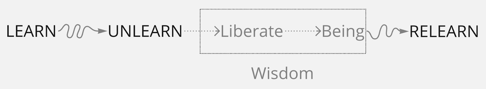
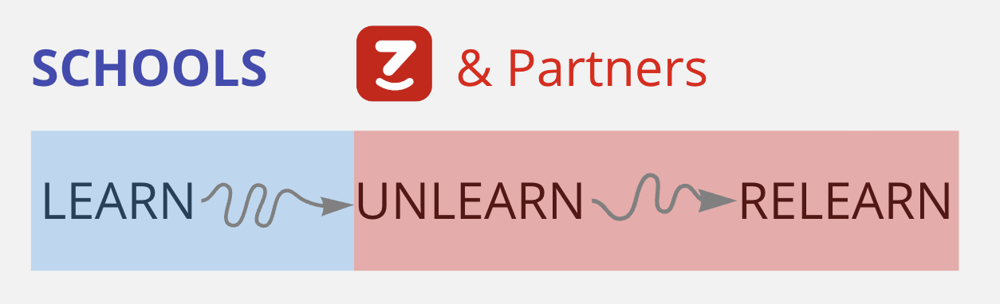

At that time, I wanted to quit school. But that meant quitting a prestigious institution along with years of hard work just to get in and considerable expectations from my family with a dream to thrive and overcome the deficient education opportunities in my home village. It also meant leaving behind all the shiny titles, track records, and accolades I had accumulated with sheer determination. I feared, with unknown reasons. I didn’t really know why I decided to apply to and pursue my studies at this university, other than “prestige and worth” - which was all everyone around me talked about. I started questioning the values of the education system that my peers and I had been embracing.

I went searching for my own answer by engaging in everything I could do outside of school. I went to many places and tried my hands at many different jobs. At a later stage in my life, I realized that was my response to “the unknown” by “unlearning and relearning”. Unlearning, to me, meant detaching all I had learned and the way I had learned, and building up completely new perspectives; while Relearning meant optimizing the learning with those new perspectives. In order to do that, I (interestingly) became a trainer with responsibilities in program design and delivery to different communities. On the path of knowing and improving myself through this profession, I continuously unlearned and relearned:

> My first unlearning and relearning: 12 years ago, I went abroad for the first time
> to attend a training program from the World Bank in Coimbatore, India. Transiting
> in Singapore, I was flabbergasted by a sparkling and modern Changi International
> Airport, just like a futuristic world straight out of a Hollywood movie. Yet India
> was a whole different story. Buses were missing doors, motorbikes looked like moving
> skeletons made of steel, and raincoats were nowhere to be found! On the first day
> of the program, I met 37 people from 20 countries with bewilderment and panic.
> I could not speak English and could not follow any of the content that made me
> feel completely helpless. On the final day of the program, I took all courage to
> share with the whole class the new way of learning I designed (since I couldn’t
> catch up well with the current method). Overwhelmed with happiness and surprise,
> I found myself winning the creative trainer award and an official certification
> (which I should not have been qualified to receive).
>
> My second unlearning and relearning: My first overseas trip had laid a foundation
> for many more trips to Asia and the U.S. within the next 02 years. I aspired to
> know more, do more, and achieve more. Once again, I started on the path of obtaining
> more shiny accolades and decided to found my first business with major support
> from national media. I failed after one year. I was so stubborn in sticking to
> what I had in an attempt to find meaning and happiness. But after all, it left
> me with emptiness. I decided to unlearn and detach once again by taking on non-profit
> educational missions in remote areas . During this period, I was exposed to and
> became deeply influenced by the educational philosophy of Jiddu Krishnamurti and
> the life philosophy of Lao Tzu. I learned to maintain my existence at the most
> basic level of needs and stayed away from all sparkling yet unnecessary attachments.
>
> My third unlearning and relearning: That year, my family went broke and my apartment
> building was unfortunately burned down, which took away many lives and caused great
> material damage. I was blessed to escape the incident. The next few months of living
> in minimalism with just a few basic sets of clothes and 20–cent meals made me feel
> enlightened and ready for all challenges to come. But once again, I fell into the
> trap of over-glorifying my means. I held this false sense of elitism and thought
> minimalism was the one and only way to an effective life. Moving from one end of
> the stubborn spectrum (“I must have it all”) to the other (“I must have nothing”),
> I realized the need to unlearn again to change my fixed mindset and find a new
> balance. I rushed back into the hustle and bustle of entrepreneurship, but with
> a different state of mind.
>
> My fourth unlearning and relearning: I had a clearer understanding of my purpose
> and my selection of means. I founded iZi in that liberated state of mind, with
> a pure wish to make knowledge and opportunities accessible for all, helping everyone
> to expand their worldview and achieve liberation. On this journey, there were times
> when I was preoccupied with how others would view and use this means. I was chasing
> numbers and results, and struggled to define the values my team and I wanted to
> create. I decided to unlearn by a trip without any expectations to the Himalayan
> mountains in Ladakh. Spending days on the snowy mountains without internet, mobile
> connection and basic commodities, I lost all connections to the outer world, but
> unexpectedly developed stronger connections with my inner self. In my previous
> unlearnings, I was always facing major psychological changes. But this time around,
> the unlearning naturally occurred through unconditional moments of joy. This newfound
> self-awareness helped me stop living so much in the future and develop a wholehearted
> appreciation for what is currently present.

In this constant and ongoing process of unlearning and relearning, I have arrived at a fundamental truth: the meaning of education is “liberation”. There are so many ways to define liberation, but to me, the concept refers to self-awareness at the highest level, self-appreciation of our very being, and thorough comprehension of all consequences of all decisions to select a means of manifesting ourselves in life.

**Joy and liberation are values that we, through iZi, want to create for our community.**

The education we received for over 16 years did not give us that. We were taught how to use the means to have productive lives and also to identify and measure ourselves with them. We became dependent on the means instead of mastering them. This does not mean that we reject the value of schools. Quite the contrary, to us, school is one of the greatest inventions of human civilization, designed for humanity to access knowledge with greater ease. Schools fulfilled its role extremely well in times when media of communication were severely lacking.

But in the context of today, the internet, telecommunications, satellite phones and efficient global transportation networks have enabled the reception of information and the construction of new worldviews freer, more objective and more personalized than ever. Meanwhile, textbooks and teachers, no matter how well-crafted, will still face the fallacies of subjective thinking. Therefore, it is necessary to supplement knowledge acquisition (“learn”) with two very important tasks: knowledge reconstruction (“unlearn”) and optimization of knowledge acquisition (“relearn”). In which, unlearning is the most fundamental process leading to liberation and can never be separated from relearning. And this should not be a one-time process but will be ongoing throughout the entire journey of life.

“Unlearn and relearn” is not a new invention but a new use of words. It is an amalgamation of human civilization that dates back almost 3,000 years ago from ancient Rome and Greece. At that time, what was discussed was an education cultivating free human beings - "liberal education". In the 19th century, the fast-paced development of industrialization and modernization pushed "liberal education" into oblivion to make way for "professional education" in most nations around the world. That was the time when education as we know it today was born and maintained for more than two centuries. “Professional education” was born to accommodate the speed at which our world needed to industrialize and modernize. That trend leads us closer to modern industrial means but further from the existential purpose (“Being”). So, learning to "unlearn" is learning to think, with the purpose of self-awareness and detachment from patterns. From that newfound thinking, we develop a more holistic worldview, and thereby form wisdom.

Unlearning and relearning can never be separated. There are two points in time most suitable for it: life events with major psychological changes and moments of unconditional joy. The former don’t happen all that often, but the latter can. That is why our guiding educational philosophy is to bring joy for our learners to accelerate the unlearning process, so that learners can obtain self-awareness and liberation. Only when liberation is achieved can “relearning” have its full effect, which is also when iZi rewards our learners with practical opportunities to make use of their means for a better livelihood and achieve their purpose of being. iZi was born with a wish to accompany schools, education institutions and the ecosystem of relevant partners on the path towards consolidating and developing the meaning of education which I have contemplated and longed to share with communities all over the world.

