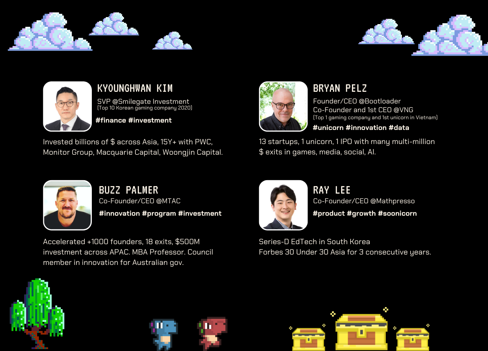

import { EmbeddedYoutube } from "@site/src/components/embedded-youtube";

import { ImageDescription } from "@site/src/components/image-description";

import { ProfileHref } from "@site/src/components/profile-href";

iZiis a gamified knowledge platform, born with a mission to “make knowledge and opportunities accessible to all”. iZi creates joy through gamification design and reward mechanisms, and delivers educational value through diverse knowledge-sharing content in interactive question formats.

Individuals, especially students, can explore knowledge and search for opportunities on our platform through playing Quests and competing for special rewards. For organizations and enterprises, iZi provides a comprehensive solution from customized game design to content creation to help internal training and community connection become more engaging and meaningful.

iZi released its first version in February 2021 and was welcomed with enthusiasm from the content creator community, teacher community and all types of events (online and offline) from the student community from over 50 universities in Vietnam. Being a simple and friendly gamification platform to create and play quizzes, iZi attracted over 3K sets of user-generated content and 100K organic users through word of mouth just within the year.

The joy and excitement from the community when using iZi nurtured our strong belief that applying gamification to knowledge sharing will be a game-changing (no pun intended) disruption to the way we teach and learn.

<EmbeddedYoutube url="https://www.youtube.com/embed/iMIxR40HNwg" />

With a strong purpose to accelerate our product innovation, our iZi team has deployed 4 consecutive experimental versions (2.0, 3.0, 4.0 and 5.0) within the next 9 months. On average, we released a new version every 2 months to upgrade the playing experience such as in-game spell, in-game chat through text, audio and video, broadcasting, debates, among others. Each version was experienced by our most loyal and active group of iZi users in order to gather their feedback on both product and business model.

<ImageDescription
  texts={[
    "Version 2.0",
    "Real-time chat through audio/video in a quiz-playing room",
  ]}
/>

<ImageDescription
  texts={[
    "Version 3.0",
    "Live broadcasting with real-time created quizzes and multi-streaming to different platforms",
  ]}
/>

<ImageDescription
  texts={[
    "Version 4.0",
    "Pre-recorded debate videos with interactive questions playable during watching",
  ]}
/>

Through all the experiments and in-depth conversations with our users, we understand:

- Most general learners care more about the learning experience rather than the content. That experience demands a lot of fun, inspiration, passion, and community connection. That is why iZi’s gameplay is designed with narrative, community-based game rules along with meaningful rewards ([read about our product roadmap here](/blog/04-the-journey-to-find)).
- Learners need educational content to be diverse yet relevant and consistent in quality. Thus, in the effort to create such diversity, iZi establishes partnerships with a variety of Content Partners including schools, institutions, and organizations, and also allows the community to contribute. We use a centralized review system to control the quality of content submitted by users. iZi content revolves around the topic of “career and finance”, along with other supporting topics ([read about our content strategy here](/blog/03-content-strategy-and-governance)).
- Furthermore, our user community also wants to be economically empowered in all social activities on our platform, from the creation and consumption of content to designing and exchanging virtual items. iZi aspires to consolidate and introduce an equitable economic mechanism for community members to be rewarded for creating educational value through content and entertainment value through designing and participating in platform activities.

In October 2022, iZi 5.0 is officially released with a completely new look. Still applying the principles of gamification design, but iZi 5.0 takes the form of a classic treasure-hunting, Quest-hunting RPG game. iZi will take you back to the year 3000 B.C. when humanity had not learned to record history. In this alternate universe, you get the chance to venture 7 Lands, each with 7 narrating characters with their unique personality and backstory. Each Land represents a major theme in the personal development of our community members, including: Being, Thinking, Exploring, Working, Communicating, Experiencing and Inventing.

<EmbeddedYoutube url="https://www.youtube.com/embed/rfXja72xaik" />

Behind the persistent efforts for these continuous improvements is a team filled with enthusiasm and passion for education, stories, and games. The iZi Team not only carries a free spirit of innovators but are also resilient and responsible warriors in their role and area of expertise.

<ProfileHref
  title={"Team Linkedin Contact:"}
  profiles={[
    { name: "Laura", href: "https://www.linkedin.com/in/lauradaophan/" },
    { name: "Heath", href: "https://www.linkedin.com/in/hieu-nguyen/" },
    { name: "Nam", href: "https://www.linkedin.com/in/nam-q-dam/" },
    { name: "Khoa", href: "https://www.linkedin.com/in/khoa-hoang/" },
    { name: "Son", href: "https://www.linkedin.com/in/sonhoaing/" },
    { name: "Cynthia", href: "https://www.linkedin.com/in/tram-cynthia/" },
    {
      name: "Hồng",
      href: "https://www.linkedin.com/in/h%E1%BB%93ng-%C4%91%E1%BB%97-thu-a4b53b1b7/",
    },
    { name: "Du", href: "https://www.linkedin.com/in/ed-pham-83722921a/" },
    { name: "Khang", href: "https://www.linkedin.com/in/khang-nguyen-hoang/" },
  ]}
/>

Fueling strength and energy for this journey are individuals who placed trust and invested in us, and continued to support us 24/7 regardless of the problem or obstacle. They are well-established entrepreneurs and investors from different places around the world, with proud contributions to our global society. They are beyond doubt a source of inspiration for us to keep moving forward with resilience in the direction of our mission.

<ProfileHref
  title={"Linkedin Contact:"}
  profiles={[
    {
      name: "Kyounghwan Kim",
      href: "https://www.linkedin.com/in/kyounghwan-kim-440934a/",
    },
    { name: "Bryan Pelz", href: "https://www.linkedin.com/in/bryanpelz/" },
    { name: "Buzz Palmer", href: "https://www.linkedin.com/in/buzzpalmer/" },
    {
      name: "Ray Lee",
      href: "https://www.linkedin.com/in/jongheun-lee-7a4399111/",
    },
  ]}
/>

We are always searching for talents with a free and fun spirit to join us in the pursuit of our mission “to make knowledge and opportunities accessible to all” through gamification. If you are who we are looking for and want to accompany us, don’t hesitate to send your coolest intro to [hr@izi.community](mailto:hr@izi.community)!
