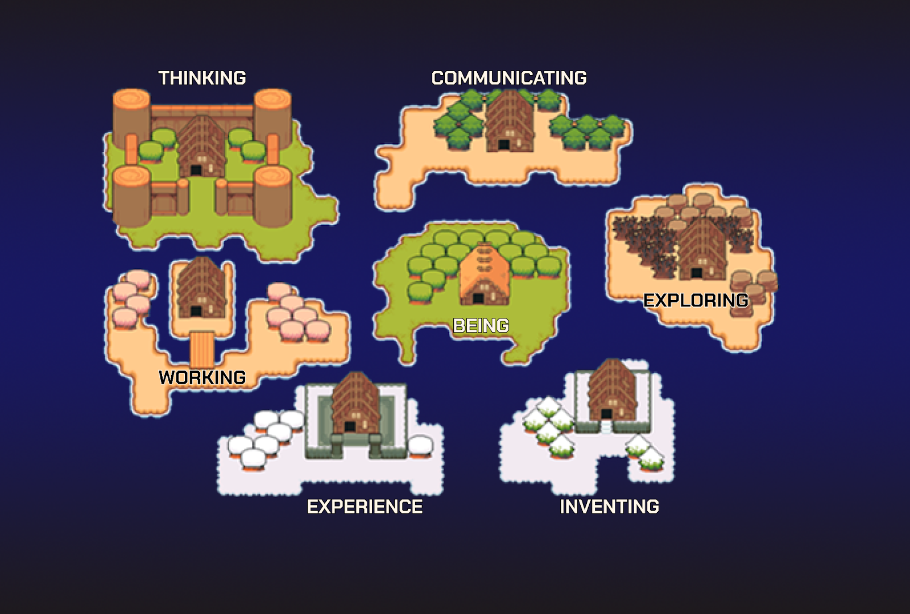

As an educational platform with the mission “to make knowledge and opportunities accessible to all”, content is the core of our business. No matter how many pivots we make, no matter how much our universe expands, and no matter how the iZi experience becomes further and further enriched, at the heart of our strategy lies an unwavering desire to help the world learn something new with every second they spend on our platform. To uphold that commitment, it is of utmost importance to maintain the highest standards for all content that users interact with and consume during the course of adventuring our iZiverse.

Content is essential as it directly manufactures the intrinsic motivation towards learning that we want to draw out from our community members. We want to draw members in with exciting rewards and opportunities, but offer a reason for you to stay and continuously spend time on our universe with impactful, delightful, and knowledge-filled content.

<h2>Our Content Strategy</h2>

The status-quo education system has long framed our mind to view knowledge in subjects or specializations. Be it Math or History or English, we habitually treat them as separate and distinct, each with its own definition of mastery and criteria for academic success.

However, to think as such is to view education as the learning of facts. Such a view accidentally leaves out the most important aspects of training your mind to think and memorize better: creating associations and making sense of complexity. Aren’t we using English as a vehicle to learn Math? How can one claim to master Biology without a thorough understanding of organic chemical reactions at the microscopic level? Aren’t all “subjects” and “specializations'' inter-connected and deeply intertwined, since the universe and life itself are such complex and constantly evolving systems that one discipline should never prove sufficient to decode? Aren’t they just over-simplified, over-glorified and over-segregated categories of knowledge, manifested to scale up educational delivery at an industrial pace and create specialized workforces that can meet the demand of the Industrial Revolutions?

At iZi, we believe that unlearning and relearning best takes place at the intersection of disruptive psychological milestones and moments of unconditional joy. It is when the acquisition of knowledge is manageably chaotic, intrinsically fun, and deliberately multi-disciplinary. Our iZiverse is divided into 07 Lands (maps) with different knowledge themes. The themes are not subject-based, but rather covering the most essential components of an individual’s personal development: Thinking, Experiencing, Exploring, Inventing, Communicating, Working, and most importantly, Being. This structure encourages users to think more critically and always be in a mindful state about their own growth, and become less attached to the traditional tendency of categorizing themselves into “verticals”. I believe this is the fundamental distinction between developing a human being versus developing a robot.

Located in different places within each map are Quests in various categories related to that component of development. For example, in the Communicating map, there is a category of Languages and in Working, there is a category of Entrepreneurship. Every content is purpose-driven (helping you understand the Why?), practical (with real-life examples and applications), and thought-provoking (encouraging critical reflections and deep thinking).

<h2>Description of the seven maps</h2>

1. Map BEING: The land of exploring oneself and the meaning of existence. You can find here wisdom of philosophy, psychology, medicine, and biology that helps us understand our body, mind and heart as a whole.
2. Map THINKING: The land where your thoughts are trained and developed through historical and societal stories, events, facts, and figures that are viewed from a variety of critical perspectives.
3. Map WORKING: The land filled with diligence and passion for meaningful work. Great lessons of entrepreneurship, finance, and careers are plentiful here.
4. Map EXPLORING: The untraveled and scenic land, where knowledge treasures about nature, the Earth, places, and survival are hidden, waiting to be discovered by the bravest.
5. Map COMMUNICATING: The joyous land filled with songs and light, where languages, cultures, and arts collide and mingle to form a lively and colorful atmosphere of delight and hope.
6. Map EXPERIENCING: The land of knowledgeable, wise and enlightened citizens, who are well-versed in math and all basic sciences, with an advanced education system built on the foundation of free thinking and learning-by-doing.
7. Map INVENTING: The land of civilization, modernity and advanced industries with humanity's newest inventions. Here, you will be introduced to the most updated knowledge on technology, engineering, and innovation.

<h2>Our Content Production</h2>

All content on iZi is created by our talented and resourceful community of Creators, and from our collaboration with selected Content Partners.

Our Creators are individuals and organizations whose accounts are verified by us. They are (teams of) teachers, educators, experts, or knowledge enthusiasts with experience and academic background related to content they contribute to our platform. They are the most fervent and skillful ambassadors of knowledge, with the ability to create content that sparks curiosity and excitement.

Our Content Partners are trusted and well-established organizations worldwide, including educational institutions, NGOs and NPOs, schools, publishers, among others. They provide accurate, diverse, and credible sources of content, exciting opportunities related to overseas studying, researching, and traveling, and in the future, official accreditation for dedicated members of our community.

<h2>Our Content Governance</h2>

Because of our rigorous determination to uphold our content standards, all user-generated content will go through a centralized review process that takes at maximum 30 minutes.

In addition, we use a community voting system for governance even after the content has been published successfully. In the next few months, we will be implementing an automatic system reviewed by AI and a mechanism to allow the user community to evaluate the quality of every content they engage with:

- First, users can rate the quality of the content using a 5-star rating scale immediately after their engagement with that content. All content with an average rating of 2 out of 5 or lower will be sent to our Quality Control team for a secondary in-depth review.
- Second, there is a reporting function where users can report inaccurate, skeptical, provocative, or offensive content to iZi. All reports will be reviewed by our Quality Control team.

<h2>Our Content Distribution</h2>

In the next phases of growing iZi, we have reserved plans to leverage artificial intelligence (AI) to provide you with a fully personalized learning path, based on your areas needing improvement and your own preferences. Suitable content will be recommended for you and curated into sequences meaningful to your personal development.

With all of the above pillars in place, we shall be deliberate and consistent in our governance of content, while gradually opening up all other components of our iZiverse, such as new maps, new characters, and new features to you, the community, to fill up and contribute with your enthused imagination and ingenious resourcefulness (view more here).

We wish to bring you a never-before-seen play-to-learn experience, as fun and free as we promised.
