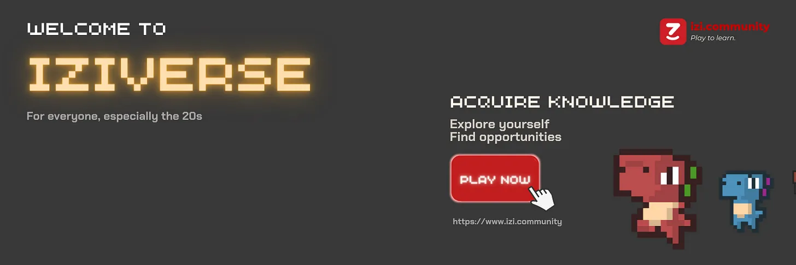

The journey to find knowledge is an adventure like no other. It might bring you to places filled with unexpected surprises. Within less than 2 years since our inception, iZi is proud to have paved the way for 2K+ creators to get out of their comfort zone and generate game-changing educational content. It is our joy to wake up everyday knowing that our 100K+ community of learners always learn something new on iZi. We are proud to see our previous prototypes welcomed with warmth from diverse communities, even from the early days when iZi was still a simplistic quiz-and-play website. However, this is all just a beginning.

iZi will now take you to a new chapter of our journey. It's a journey to a parallel play-to-learn universe called the iZiverse - where you have more freedom than ever to explore, garner, and apply knowledge in any aspect of life through gamification design, multi-formatted Q&A content, and our brand-new rewarding mechanism. The iZiverse wants to present our community an unique opportunity - to evolve into a liberal community where users will hold the most power in giving, obtaining and creating value. We've been working hard on this for months now and are excited to share it with you!

<h2>Our Vision</h2>

iZi wants to build a liberal community by giving them access to diversity of knowledge through joy and freedom. At iZi, we uphold an education philosophy that obtaining knowledge best comes in the form of “unlearning and relearning” happening during disruptive psychological milestones and moments of unconditional joy. At that intersection, knowledge acquisition becomes most effective, as it takes place in a manageably chaotic, intrinsically fun, and deliberately multi-disciplinary context.

Isn’t it time more people have access to a proactive and delightful experience of acquiring and sharing knowledge? Isn’t it time content creators have a platform that freed them from the creative leashes and helped them to generate game-changing educational content? Isn’t it the time for people to learn, unlearn and relearn in a liberal community? iZi knows the answer. iZi IS the answer.

Freedom is at the heart of iZi’s products and community. We strive for the creation of a playground where both creators and community members freely interact within a set of ground rules. We encourage freedom from our content creators to bring unconventional educational Quests to learners within iZi’s community guidelines. We value the freedom of choice of our community members to have a say in what they want to learn and decide which creator to support. In short, iZi encourages “manageable chaos” in knowledge sharing and learning.

A suitable platform plays a pivotal role in nurturing creativity and curiosity. The iZiverse lays the foundation for the personal growth journeys of countless generations of creators and learners. Seven Lands of the universe represent a massive world filled with challenges as well as opportunities for iZi explorers to overcome themselves as we believe only through chaos can one only move forward in the journey of self-discovery. Hidden and scattered within each Land, knowledge comes in the form of Quests (multimedia and multi-format Q&A games) with meticulously narrated content, adorable accompanying characters with their own personality and backstory, and attractive rewards in the form of gifts or unique opportunities.

<h2>Product Roadmap - Q4/2022</h2>

Quarter 4 of 2022 will mark an important milestone of iZi as we aim to end the year on a high note. Highly anticipated features will be released accompanied by important product updates that will lay the foundation for future expansions and integrations.

<h2>iZi 5.0 - iOS & Android release, Stability Monitoring and Improvement</h2>

iZi anytime, anywhere! We are thrilled to announce that iZi is coming to your mobile devices! This is a highly requested expansion that was pushed by our community and made for our community. Interacting with iZi has never been easier. A nod to classical 8-bit gaming experience right from your pocket. Official details of iZi’s iOS and Android launch will be announced in the near future. Stay tuned!

Stability is undoubtedly one of the most important factors for the iZiverse to become a regular space for our users and a stepping stone to unlock your potential. Huge efforts have been made in all aspects, including gameplay, reward system, content creating mechanisms and admin duty. Still, we are pushing hard for that extra mile to bring the best experience to our community.

<h2>
  iZi 5.1 - Multiplayer, Rating & Report System, and Question Bank Updates
</h2>

The iZiverse will become truly lively in iZi 5.1, when we introduce our multiplayer mode, in which players will be invited to participate in competitive high-stake “knowledge tournaments'' held on a real-time basis. This brand-new game mode will be a significant boost to iZi’s community experience as we have noticed the desire among our community to have the appropriate stage to showcase their knowledge and compete with their friends and fellow members.

To support the multiplayer mode, a Question Bank will be added to further allow creators to contribute to our ever-expanding content database with greater ease.

Finally, to further empower our community and create a healthy environment among the iZiverse, we will introduce the Rating and Report system. Our users, both creators and learners, will have a say in vetting content quality so that the iZi Quality Control team will have a credible point of reference when it comes to nurturing and publishing suitable content.

<h2>iZi 5.2 - Storytelling Format, Daily Mission, Social and Notification</h2>

This is what we meant when we said that iZi will “end 2022 on a high note”. A crucial factor to a successful game is the “fun” factor - an attractive narrative and multiple game modes. As iZi continues to grow, our characters have come to life on their own and become an indispensable part of our community experience. While nothing much can be revealed at this point, we can tell that the story will be full of heart, courage and desire in the search for knowledge.

In addition, Daily Missions will be introduced to invite users to explore more side quests and be rewarded in more diverse ways for their consistent efforts of learning and sharing.

Social Features and Push Notifications will be the last features that iZi will introduce in the year of the Tiger. With this release, you can officially connect, chat and form clans with other users on the platform, and receive the latest updates on our rewarded campaigns, knowledge tournaments, and other official events directly to your home screen. We would like to call this phase “iZi Syndrome” as we encourage our community to cover social network sites with iZi presence and to never miss out on anything with our notification push.

<h2>Conclusion</h2>

We have a lot of work ahead of us, but we’re excited to see where this journey will take us! And the best part is still ahead of us. Stay tuned and follow iZi for the latest announcements.
